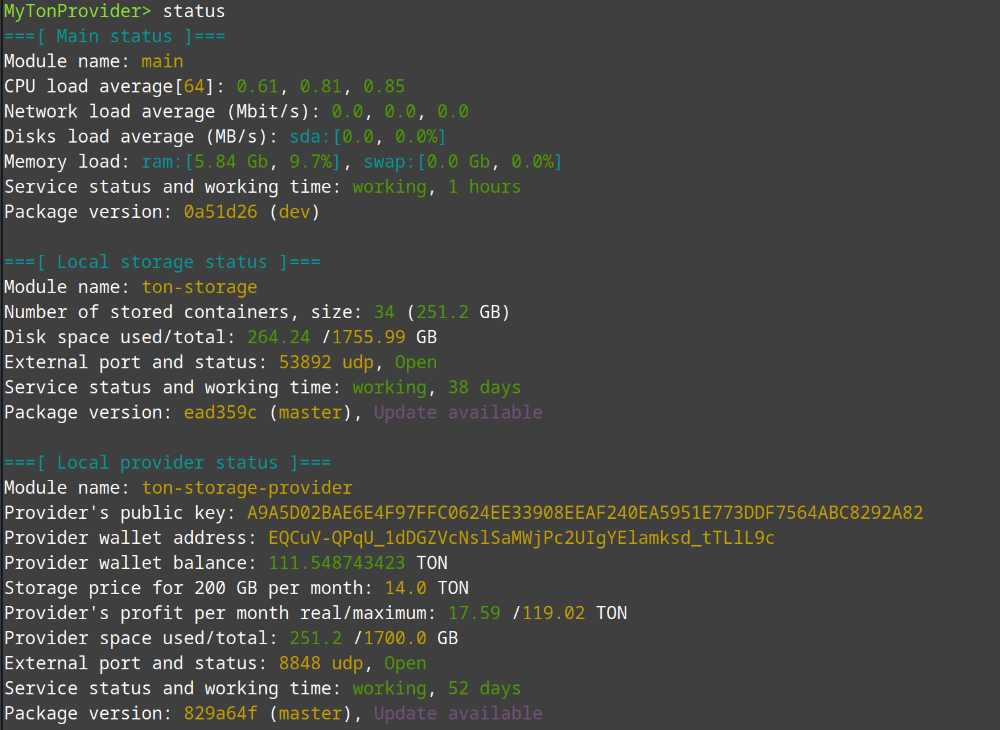

# What is MyTonProvider?
MyTonProvider is a console application that serves as a convenient wrapper for `ton_storage`, `ton_storage_provider` and `ton_tunnel_provider`. It has specially developed for provider management tasks in the Linux operating system.



# Description of modules
```bash
telemetry - Sends telemetry to the server. Allows you to move up in the list of providers.
ton_storage - Downloads, stores and distributes files via ADNL protocol. Requires ton_storage_provider to work. 
ton_storage_provider - Concludes storage contracts, sends confirmations and receives payment. Allows you to earn income for storing other people's files.
ton_tunnel_provider - Concludes contracts for traffic routing. Allows you to earn income for proxying someone else's traffic through your IP address.
```

# How to install:
1. Download the installer and run it:
```bash
wget https://raw.githubusercontent.com/igroman787/mytonprovider/master/scripts/install.sh
bash install.sh
```

2. During the installation process, select all available modules (selection is done by pressing space):
```bash
[?] Select modules: 
   [X] telemetry
   [X] ton-storage
   [X] ton-storage-provider
```

3. Specify the path for the provider files, the price for storage and what size to allocate to the provider:
```bash
[?] Storage location: /var/storage
[?] Storage price per 200gb per month: 10
[?] Storage maximum allocated size (disk space: 1755.99, free 1747.64): 1700
```

4. After installation is complete, run mytonprovider:
```bash
> mytonprovider
```

5. Take the wallet address from the mytonprovider status and top it up with one coin:
```bash
MyTonProvider> status
```

6. Register in the list of providers. This action will send a transaction to a common address on the blockchain and allow users to find you to enter into a file storage agreement:
```bash
MyTonProvider> register
```

7. Done. After a while, your provider will appear in the list of providers on the site https://mytonprovider.org

8. It is advisable, but not necessary - to make a backup of your private key in a safe place:
```bash
MyTonProvider> export_wallet
```


# Telemetry
We recommend enabling telemetry to improve your ranking in the list of providers. However, you can disable telemetry if you wish.
To disable telemetry during installation, disable the telemetry module:
```bash
[?] Select modules: 
   [ ] telemetry
   [X] ton-storage
   [X] ton-storage-provider
```

To disable telemetry after installation, follow these steps::
```bash
MyTonProvider> set send_telemetry false
```
